# External Contributor Workflow Documentation

This directory contains the complete automated workflow system for managing external contributors to the Medicine Tracker repository.

## 📚 Documentation Index

### Quick Start
- **[WORKFLOW_QUICK_REFERENCE.md](WORKFLOW_QUICK_REFERENCE.md)** - One-page cheat sheet with commands and examples
- **[MAINTAINER_GUIDE.md](MAINTAINER_GUIDE.md)** - Comprehensive guide for repository maintainers

### Technical Documentation  
- **[WORKFLOW_ARCHITECTURE.md](WORKFLOW_ARCHITECTURE.md)** - System design, data flows, and integration details
- **[copilot-instructions.md](copilot-instructions.md)** - Default agent configuration and delegation rules
- **[../AGENTS.md](../AGENTS.md)** - Agent specifications and responsibilities

### Contributor Information
- **[../CONTRIBUTING.md](../CONTRIBUTING.md)** - Guidelines for both internal and external contributors

---

## 🎯 What This Workflow Does

Automates the complete lifecycle of external contributions:

1. **Branch Setup** - Creates isolated workspace and grants temporary access
2. **PR Validation** - Runs automated quality and sanity checks
3. **Access Cleanup** - Revokes permissions after completion

All managed by specialized AI agents with clear responsibilities and security boundaries.

---

## 🤖 Agent Files

Located in `agents/`:

| **Agent File**                                 | **Purpose**                          | **Triggered By**              |
|------------------------------------------------|--------------------------------------|-------------------------------|
| `step1-contribution-branch-preparer.agent.md`  | Create branch, grant temp access     | Maintainer (on setup issue)   |
| `step2-contribution-pr-validator.agent.md`     | Validate PR quality                  | Maintainer (when PR opened)   |
| `step3-contribution-access-cleaner.agent.md`   | Revoke access after completion       | Maintainer (after PR merged)  |

---

## 🛠️ Skill Files

Located in `skills/`:

| **Skill File**                      | **Purpose**                              | **Used By**        |
|-------------------------------------|------------------------------------------|--------------------|
| `check-duplicate-assets.SKILL.md`   | Search for duplicate functionality       | Step 2 (Test 2)    |
| `validate-readme.SKILL.md`          | Validate documentation completeness      | Step 2 (Test 3)    |

Skills are reusable components that agents invoke for specific tasks.

---

## 🔄 Typical Workflow

```mermaid
graph LR
    A[Contributor<br/>Requests Access] -->|Issue Created| B[Maintainer<br/>Triggers Step 1]
    B --> C[Agent Creates<br/>Branch + Access]
    C --> D[Contributor<br/>Makes Changes]
    D --> E[Contributor<br/>Opens PR]
    E --> F[Maintainer<br/>Triggers Step 2]
    F --> G[Agent Validates<br/>PR Quality]
    G --> H[Maintainer<br/>Reviews + Merges]
    H --> I[Maintainer<br/>Triggers Step 3]
    I --> J[Agent Revokes<br/>Access]
    
    style C fill:#e1f5ff
    style G fill:#fff4e1
    style J fill:#ffe1e1
```



---

## 📋 Quick Commands for Maintainers

### Setup a Contributor
```markdown
@copilot Use step1-Contribution Branch Preparer
```

### Validate a PR
```markdown
@copilot Use step2-Contribution PR Validator
```

### Cleanup After Merge
```markdown
@copilot Use step3-Contribution Access Cleaner
```

---

## 🔐 Security Features

- ✅ **Scoped Access**: Contributors can only push to their specific branch
- ✅ **Temporary**: Access automatically revoked after PR completion
- ✅ **No Merge Rights**: Maintainers retain full control over merges
- ✅ **Audit Trail**: All actions logged in issue/PR comments
- ✅ **State Validation**: Each stage validates prerequisites before executing

---

## 📖 Which Document Should I Read?

### I'm a maintainer and need to...
- **Set up my first contributor**: Read [MAINTAINER_GUIDE.md](MAINTAINER_GUIDE.md)
- **Quickly look up commands**: Use [WORKFLOW_QUICK_REFERENCE.md](WORKFLOW_QUICK_REFERENCE.md)
- **Understand the system design**: Read [WORKFLOW_ARCHITECTURE.md](WORKFLOW_ARCHITECTURE.md)
- **Troubleshoot an issue**: Check [MAINTAINER_GUIDE.md](MAINTAINER_GUIDE.md) → Troubleshooting section

### I'm a contributor and need to...
- **Understand how to contribute**: Read [../CONTRIBUTING.md](../CONTRIBUTING.md)
- **Get write access to make changes**: Create an issue requesting setup (see CONTRIBUTING.md)

### I'm customizing the workflow and need to...
- **Modify agent behavior**: Edit files in `agents/` directory
- **Add new validation checks**: See [WORKFLOW_ARCHITECTURE.md](WORKFLOW_ARCHITECTURE.md) → Extension Points
- **Create new reusable skills**: Add `.SKILL.md` files to `skills/` directory
- **Change delegation rules**: Edit [copilot-instructions.md](copilot-instructions.md)

---

## 🧪 Testing the Workflow

### Prerequisites
1. Repository admin access
2. GitHub CLI (`gh`) installed and authenticated
3. Copilot with agent support enabled

### Test Scenario

1. **Create a test issue**:
   ```markdown
   Title: TEST: External Contributor Setup for @test-user
   
   Body: Testing the automated workflow. Please set up branch for test user.
   ```

2. **Trigger Step 1**:
   ```
   @copilot Use step1-Contribution Branch Preparer
   ```
   
   Expected: Branch created, access granted, instructions posted

3. **Simulate PR** (create manually):
   ```bash
   git checkout -b contrib/test-user-test
   echo "# Test" > TEST.md
   git add TEST.md
   git commit -m "test: validate workflow"
   git push origin contrib/test-user-test
   gh pr create --title "TEST: Workflow validation" --body "Testing PR validation"
   ```

4. **Trigger Step 2**:
   ```
   @copilot Use step2-Contribution PR Validator
   ```
   
   Expected: Validation results posted

5. **Merge PR manually**, then trigger Step 3:
   ```
   @copilot Use step3-Contribution Access Cleaner
   ```
   
   Expected: Access revoked, confirmation posted

---

## 🤝 Contributing to the Workflow

Improvements welcome! To modify the workflow:

1. **Agent changes**: Edit `.agent.md` files in `agents/`
2. **Skill changes**: Edit `.SKILL.md` files in `skills/`
3. **Documentation**: Update corresponding markdown files
4. **Test thoroughly**: Use test scenario above before deploying

---

## 📞 Support

- **Issues**: File a GitHub issue with `workflow` label
- **Questions**: Create a discussion in GitHub Discussions
- **Escalation**: Tag repository maintainers

---

## 📄 License & Attribution

This workflow system is part of the Medicine Tracker project.

**Technology Stack**:
- GitHub Copilot Agents
- GitHub CLI
- Markdown skills system

**Version**: 1.0  
**Last Updated**: April 2026
