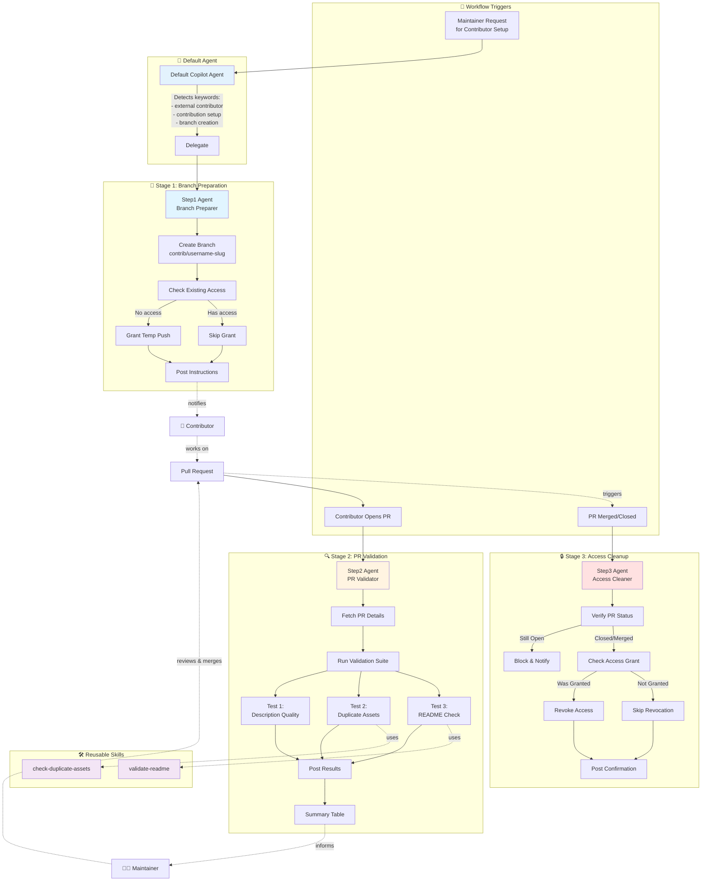
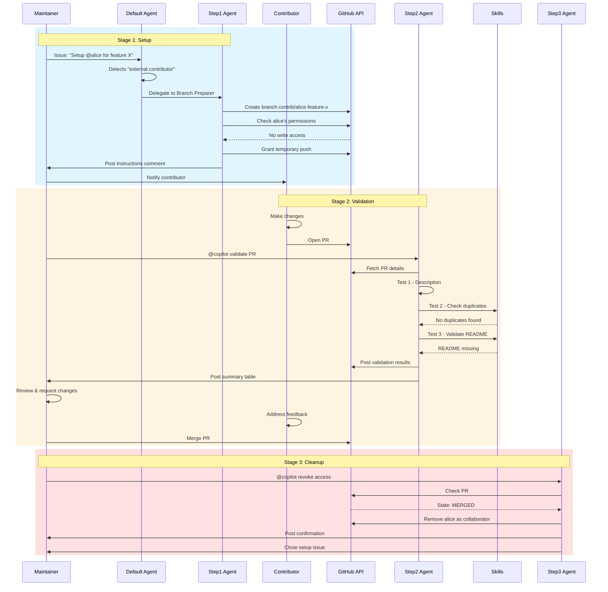

# External Contributor Workflow Architecture

This document provides a comprehensive view of the automated external contributor workflow system.

## System Architecture



## Component Overview

### 1. Default Agent (Delegation Hub)

**File**: `.github/copilot-instructions.md`

**Purpose**: Detect external contributor requests and delegate to specialized agents

**Trigger Keywords**:
- "external contributor"
- "contribution setup"
- "onboard contributor"
- "new contributor"
- "create branch for @username"
- "temporary access"

**Behavior**: Must NEVER handle contributor setup directly; immediately delegates to Step 1 agent

---

### 2. Stage 1: Branch Preparation Agent

**File**: `.github/agents/step1-contribution-branch-preparer.agent.md`

**Purpose**: Create isolated workspace for contributor

**Capabilities**:
- Extract contributor username from issue
- Generate branch name: `contrib/<username>-<slug>`
- Create branch from latest default branch
- Check existing collaborator permissions
- Grant temporary push access (if needed)
- Post checkout instructions

**Tools Used**: `execute` (GitHub CLI)

**Output**: Comment with branch name, access status, and instructions

---

### 3. Stage 2: PR Validation Agent

**File**: `.github/agents/step2-contribution-pr-validator.agent.md`

**Purpose**: Run automated quality and sanity checks

**Validation Tests**:

#### Test 1: Description Quality
- Checks PR title and body clarity
- Verifies purpose, changes, and context are explained
- Provides constructive feedback if lacking

#### Test 2: Duplicate Asset Detection
- Uses `check-duplicate-assets` skill
- Searches for similar components, utilities, or files
- Flags potential refactoring opportunities

#### Test 3: Documentation Validation
- Uses `validate-readme` skill
- Checks for README presence and completeness
- Generates template if missing

**Tools Used**: `execute`, `read`, `search`

**Output**: Per-test comments + summary table

---

### 4. Stage 3: Access Cleanup Agent

**File**: `.github/agents/step3-contribution-access-cleaner.agent.md`

**Purpose**: Revoke temporary permissions after completion

**Safety Checks**:
- Verifies PR is closed/merged (blocks if open)
- Confirms access was granted in Stage 1
- Does NOT revoke pre-existing access

**Capabilities**:
- Query PR status via GitHub API
- Remove collaborator via API
- Post confirmation or error details

**Tools Used**: `execute` (GitHub CLI)

**Output**: Confirmation comment

---

## Skill System

### Skill: check-duplicate-assets

**File**: `.github/skills/check-duplicate-assets.SKILL.md`

**Purpose**: Search codebase for existing similar functionality

**Process**:
1. Extract component/utility names from PR files
2. Search recursively in relevant directories (`src/components/`, `src/utils/`)
3. Use semantic search for functional similarity
4. Report findings with recommendations

**Used By**: Stage 2 (Test 2)

---

### Skill: validate-readme

**File**: `.github/skills/validate-readme.SKILL.md`

**Purpose**: Ensure comprehensive documentation exists

**Validation Criteria**:
- README file presence
- Required sections (Overview, Usage, API, Examples)
- Visual diagrams for complex flows

**Behavior**:
- If missing: Generate template with Mermaid diagram
- If incomplete: List missing sections
- If complete: Confirm pass

**Used By**: Stage 2 (Test 3)

---

## Data Flow



---

## Security Model

### Access Control

| **Phase**     | **Contributor Access**              | **Maintainer Control**           |
|---------------|-------------------------------------|----------------------------------|
| Pre-Setup     | None                                | Full                             |
| Stage 1       | Push to `contrib/*` branch only     | Full (can revoke anytime)        |
| Stage 2       | Same                                | Full (must approve merge)        |
| Stage 3       | None (revoked)                      | Full                             |

### Safety Features

1. **Scoped Permissions**: Push access limited to specific branch
2. **No Merge Rights**: Contributors cannot merge PRs
3. **Audit Trail**: All actions logged in issue/PR comments
4. **Manual Merge Gate**: Maintainers retain final approval
5. **Automatic Cleanup**: Access revoked immediately after completion
6. **State Validation**: Stage 3 blocks if PR still open

---

## Integration Points

### Default Agent Integration

**Delegation Logic** (in `.github/copilot-instructions.md`):

```markdown
When an issue contains:
- "external contributor"
- "contribution setup"  
- "@username" + "branch"

Action: runSubagent("step1-Contribution Branch Preparer")
```

### Skill Integration

**In Agent Files**:
```yaml
tools: ["execute", "read", "search"]
```

**In Validation Code**:
```markdown
Use the check-duplicate-assets skill to search for similar files
```

---

## Extension Points

### Adding New Validation Tests

**File**: `step2-contribution-pr-validator.agent.md`

Add to the "Checks" section:

```markdown
**Test 4 — [Your Check Name]**
[Description of what to check]

**Duplicate-comment guard:** Check for existing `## Test 4: [Name]` comment

Post/update:
## Test 4: [Name]
Status: PASS ✅ / NEEDS WORK ⚠️
```

Update the final summary table to include the new test.

### Creating New Skills

**Location**: `.github/skills/your-skill-name.SKILL.md`

**Required YAML frontmatter**:
```yaml
---
name: your-skill-name
description: Brief purpose
applyTo:
  - "**/*"
---
```

**Content**: Detailed instructions for accomplishing the skill's task

### Custom Branch Naming

**File**: `step1-contribution-branch-preparer.agent.md`

Modify the branch creation logic:
```bash
# Current:
BRANCH_NAME="contrib/$CONTRIBUTOR-$SLUG"

# Custom example:
BRANCH_NAME="external/$SLUG-by-$CONTRIBUTOR"
```

---

## Monitoring & Observability

### Success Indicators

- ✅ Stage 1 completes with "Write access granted" comment
- ✅ Stage 2 completes with validation summary table
- ✅ Stage 3 completes with "Access revoked" confirmation

### Error Patterns

| **Error**                          | **Agent**  | **Resolution**                     |
|------------------------------------|------------|------------------------------------|
| "Could not create branch"          | Stage 1    | Check branch doesn't already exist |
| "Permission denied"                | Stage 1    | Agent needs admin repo permissions |
| "PR not found"                     | Stage 2    | Verify PR number in comment        |
| "PR is still open"                 | Stage 3    | Merge or close PR first            |

### Audit Trail

All agent actions are documented in:
- **Issue comments** (setup and cleanup confirmations)
- **PR comments** (validation results)
- **GitHub collaborator log** (access grants/revokes)

---

## Best Practices

### For Maintainers

1. **Always trigger in issues**, not in PRs
2. **Wait for each stage** to complete before triggering the next
3. **Review validation results** before merging
4. **Manually merge** - agents validate but don't approve
5. **Verify access revoked** after Stage 3 completes

### For Contributors

1. **Wait for branch setup** before starting work
2. **Only push to assigned branch** (`contrib/your-username-*`)
3. **Follow validation feedback** to improve PR
4. **Be patient** - maintainers must manually approve

### For Repository Setup

1. **Grant bot permissions** - Agents need admin access to manage collaborators
2. **Protect default branch** - Require PR reviews
3. **Use issue templates** - Standardize contributor requests
4. **Document clearly** - Keep CONTRIBUTING.md updated

---

## Troubleshooting Guide

### Issue: Agent Doesn't Respond

**Symptoms**: No response after mentioning agent

**Checks**:
- Is agent name exact? (`step1-Contribution Branch Preparer`)
- Is Copilot enabled for the repository?
- Are you in the correct repository?

**Solution**: Re-trigger with exact agent name

---

### Issue: Branch Already Exists

**Symptoms**: Stage 1 fails with "branch exists" error

**Checks**:
- Was branch created in previous attempt?
- Is contributor reusing same feature name?

**Solution**: Delete old branch or use different slug

---

### Issue: Access Not Granted

**Symptoms**: Stage 1 completes but contributor can't push

**Checks**:
- Did agent post "Write access granted"?
- Does agent have admin permissions?

**Solution**: Manually grant via Settings → Collaborators

---

### Issue: Validation Skips Tests

**Symptoms**: Stage 2 doesn't run all tests

**Checks**:
- Are PR files accessible?
- Does PR have enough changes to validate?

**Solution**: Check PR diff availability; re-trigger agent

---

### Issue: Access Not Revoked

**Symptoms**: Stage 3 completes but user still has access

**Checks**:
- Did agent post "Access revoked" confirmation?
- Was access granted in Stage 1?

**Solution**: Manually remove via Settings → Collaborators

---

## Version History

| **Version** | **Date**    | **Changes**                              |
|-------------|-------------|------------------------------------------|
| 1.0         | April 2026  | Initial workflow implementation          |

---

## Related Documentation

- [MAINTAINER_GUIDE.md](MAINTAINER_GUIDE.md) - Detailed usage guide
- [WORKFLOW_QUICK_REFERENCE.md](WORKFLOW_QUICK_REFERENCE.md) - One-page cheat sheet
- [CONTRIBUTING.md](../CONTRIBUTING.md) - Contributor guidelines
- [AGENTS.md](../AGENTS.md) - Agent specifications
- [copilot-instructions.md](copilot-instructions.md) - Default agent configuration
