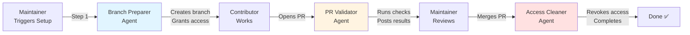

# External Contributor Workflow - Quick Reference

## 🎯 Overview

Three-stage automated workflow for secure external contributions using specialized AI agents.

---

## 🔄 Workflow Stages



---

## 📋 Quick Commands

### Stage 1: Setup Branch & Access
```markdown
@copilot Use step1-Contribution Branch Preparer
```
**Creates**: `contrib/<username>-<slug>`  
**Grants**: Temporary push access  
**Posts**: Checkout instructions for contributor  

---

### Stage 2: Validate Pull Request
```markdown
@copilot Use step2-Contribution PR Validator
```
**Checks**:
- ✅ PR description quality
- ✅ Duplicate assets/functionality
- ✅ README documentation

**Posts**: Validation report with pass/warn/fail for each check

---

### Stage 3: Revoke Access
```markdown
@copilot Use step3-Contribution Access Cleaner
```
**Verifies**: PR closed/merged  
**Revokes**: Temporary push access  
**Posts**: Confirmation comment  

---

## 🔍 Validation Checklist

The PR Validator agent checks:

| **Check**              | **What It Does**                                    |
|------------------------|-----------------------------------------------------|
| Description Quality    | Ensures PR has clear purpose, changes, and context  |
| Duplicate Assets       | Searches for similar components/utilities           |
| Documentation          | Validates README exists and is comprehensive        |

Results posted as:
- ✅ **PASS** - Meets standards
- ⚠️ **NEEDS WORK** - Suggestions provided
- ❌ **MISSING** - Template generated

---

## 📁 File Structure

```
.github/
├── agents/
│   ├── step1-contribution-branch-preparer.agent.md
│   ├── step2-contribution-pr-validator.agent.md
│   └── step3-contribution-access-cleaner.agent.md
├── skills/
│   ├── check-duplicate-assets.SKILL.md
│   └── validate-readme.SKILL.md
├── copilot-instructions.md         # Default agent delegation rules
└── MAINTAINER_GUIDE.md             # Detailed maintainer documentation
```

---

## 🎬 Complete Example

### Day 1: Contributor Requests Access
**Contributor** creates issue:
> Title: External Contributor Setup: @alex - medication reminders  
> I'd like to add a reminder feature for medications.

**Maintainer** comments:
```
@copilot Use step1-Contribution Branch Preparer
```

**Agent** responds:
> 🌿 Branch prepared: `contrib/alex-medication-reminders`  
> Write access granted to @alex

---

### Day 5: Contributor Opens PR
**Contributor** opens PR #42

**Maintainer** comments:
```
@copilot Use step2-Contribution PR Validator
```

**Agent** posts validation:
| Check               | Result           |
|---------------------|------------------|
| Description         | ✅ PASS          |
| Duplicates          | ⚠️ Overlap found |
| Documentation       | ⚠️ README needed |

---

### Day 7: PR Merged
**Maintainer** merges PR #42

**Maintainer** comments on original issue:
```
@copilot Use step3-Contribution Access Cleaner
```

**Agent** responds:
> 🔒 Access revoked for @alex. Thank you for your contribution!

---

## 🛠️ Troubleshooting

| **Issue**                    | **Solution**                                           |
|------------------------------|--------------------------------------------------------|
| Agent doesn't respond        | Use exact agent names; check permissions               |
| Access not granted           | Manually grant via Settings → Collaborators            |
| Validation doesn't run       | Ensure PR is from `contrib/*` branch; re-trigger       |
| Access not revoked           | Verify PR is closed/merged; manually remove if blocked |

---

## 🔐 Security Features

- ✅ **Scoped Access**: Push to specific branch only
- ✅ **Temporary**: Auto-revoked after completion
- ✅ **No Merge Rights**: Maintainers retain full control
- ✅ **Audit Trail**: All actions logged in issue/PR comments

---

## 📚 Documentation Links

- **Detailed Guide**: [.github/MAINTAINER_GUIDE.md](.github/MAINTAINER_GUIDE.md)
- **Agent Specs**: [AGENTS.md](../AGENTS.md)
- **Contributor Guide**: [CONTRIBUTING.md](../CONTRIBUTING.md)
- **Default Agent Rules**: [.github/copilot-instructions.md](.github/copilot-instructions.md)

---

## 💡 Tips

- Always trigger agents in the **original setup issue** (not in PRs)
- Use @ mentions for contributors consistently (@username)
- Merge/close PRs manually; agents validate but don't merge
- Check agent comments for errors; escalate to manual if needed
- Stage 3 must wait until PR is closed OR merged

---

**Last Updated**: April 2026  
**Version**: 1.0
