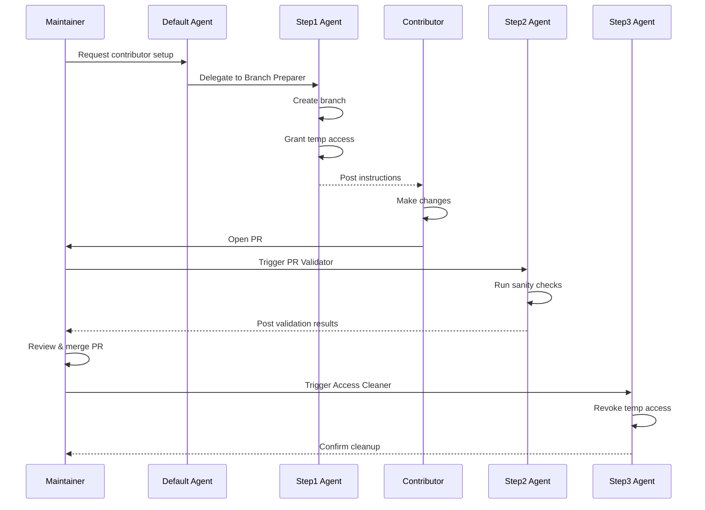

# Medicine Tracker — Repository Instructions

## Tech Stack

- **Framework**: React 18 with TypeScript
- **Build**: Vite with HMR
- **Styling**: Tailwind CSS
- **Storage**: Browser localStorage

## Common Commands

- `npm install` - Install dependencies
- `npm run dev` - Start dev server
- `npm run build` - Build for production
- `npm run preview` - Preview production build

## Code Standards

- Use TypeScript strict mode - no `any` types
- Components: Functional components with hooks (no class components)
- Types: Define in `src/types/` directory
- Storage: Use `src/utils/storage.ts` for all localStorage operations
- Styling: Tailwind utility classes (avoid custom CSS unless necessary)

---

## External Contributor Workflow

**CRITICAL**: The default agent must **never** handle external contributor setup directly.

### Delegation Rules

When an issue or request contains **any** of these triggers:
- Keywords: "external contributor", "contribution setup", "onboard contributor", "new contributor"
- Requests for branch creation for a specific user
- Requests for temporary repository access
- Mentions setting up a contributor workspace

**Actions Required**:
1. **Immediately delegate** to the appropriate specialized agent:
   - **Step 1**: `step1-Contribution Branch Preparer` - Creates branch and grants access
   - **Step 2**: `step2-Contribution PR Validator` - Validates PR quality
   - **Step 3**: `step3-Contribution Access Cleaner` - Revokes access after completion

2. **Do NOT**:
   - Attempt to create branches yourself
   - Grant or revoke repository permissions
   - Handle any part of the contributor workflow independently

3. **If uncertain**: Flag for human maintainer review rather than proceeding

### Example Delegation

```markdown
User: "Set up a branch for @jdoe to work on the login fix"

Default Agent Response:
"I'll delegate this to the Contribution Branch Preparer agent to set up the branch and access for @jdoe."

[Invoke subagent: step1-Contribution Branch Preparer]
```

### Workflow Stages



See [MAINTAINER_GUIDE.md](MAINTAINER_GUIDE.md) for detailed usage.