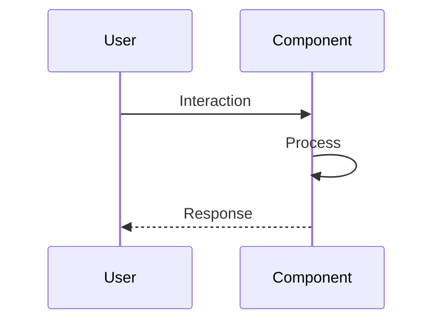

# Validate README Documentation

Assess README quality for new features or components, ensuring comprehensive documentation.

## Usage

Invoke this skill when:
- Reviewing pull requests that add new features/components
- Validating external contributions
- Ensuring documentation standards are met

## Validation Criteria

### 1. Presence Check
- Does a README exist for the new feature/component?
- Is it in the expected location?
  - Component: `src/components/ComponentName/README.md` or inline docs
  - Feature: Root `README.md` updated with new feature section
  - Utility: Documented in code comments or dedicated docs

### 2. Content Quality

Check for these essential sections:

#### For Features
- [ ] **Overview**: What the feature does
- [ ] **Usage**: How to use it with examples
- [ ] **Configuration**: Any settings or props
- [ ] **Examples**: Code snippets or screenshots
- [ ] **Dependencies**: Required packages or components

#### For Components
- [ ] **Purpose**: Component's role
- [ ] **Props/API**: Input parameters with types
- [ ] **Usage Example**: JSX code sample
- [ ] **Styling**: CSS classes or customization info

### 3. Diagram Check
- For complex flows, is there a visual diagram?
- Prefer Mermaid diagrams for sequence flows or architecture

## Process

1. **Locate documentation**:
   ```bash
   # Find all markdown files in PR
   gh pr view $PR --json files --jq '.files[].path' | grep -E '\.md$'
   
   # Check for inline JSDoc comments in components
   grep -A 10 '/\*\*' src/components/NewComponent.tsx
   ```

2. **Assess completeness**:
   - Read existing README sections
   - Check against criteria above
   - Note missing or incomplete sections

3. **Generate draft if missing**:
   If README is absent or incomplete, generate a template:

````markdown
## [Feature/Component Name]

### Overview
[Brief description of what this does]

### Usage
```tsx
import { ComponentName } from './components/ComponentName';

function App() {
  return <ComponentName prop1="value" />;
}
```

### Props/API
- `prop1` (string): Description
- `prop2` (boolean, optional): Description

### Example
[Working example or screenshot]

### Flow Diagram

````

## Output Format

Return a structured assessment:

```markdown
## README Validation Results

**Status**: COMPLETE ✅ | NEEDS IMPROVEMENT ⚠️ | MISSING ❌

### Documentation Found
- [x] README exists at `docs/feature.md`
- [x] Overview section present
- [ ] Usage examples missing
- [ ] Visual diagram missing

### Recommendations
1. Add usage examples with code snippets
2. Include a Mermaid sequence diagram showing the interaction flow
3. Document edge cases or limitations

### Generated Template
[If missing, include draft README content here]
```

## Best Practices

- Be constructive, not prescriptive
- Acknowledge existing inline documentation
- Suggest improvements, don't demand perfection
- Provide ready-to-use templates when documentation is missing
